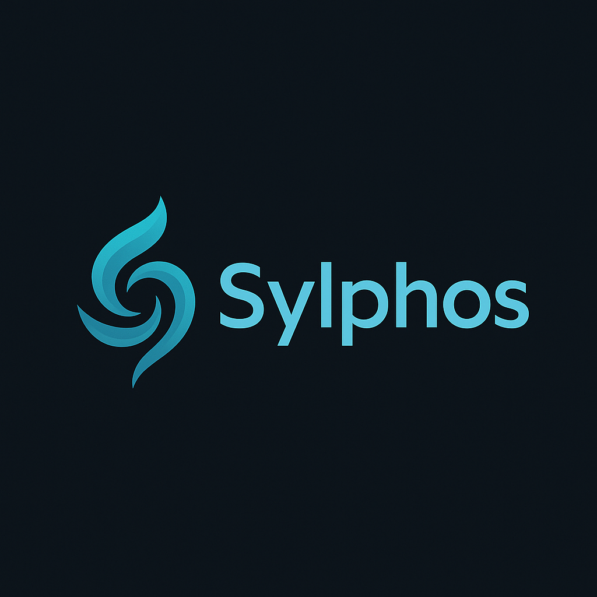

<div align="center">
  

# Sylphos

**让语音成为人与智能体之间自然、可信、可编排的入口。**

Sylphos 是一个面向本地语音交互与智能体运行时的 Python 项目。你可以把它想象成一只住在电脑里的“风之信使”：它安静地听见你的唤醒词，把一句话拆成可理解的事件，再把智能体的行动与回应送回现实世界。

</div>

---

## 为什么叫 Sylphos？

“Sylphos” 这个名字来自我们对语音智能体的想象：

- **Sylph** 像空气中的精灵，代表声音、气流、轻盈与随叫随到的存在感。语音交互最迷人的地方，正是它不像按钮那样笨重，而像一句话、一阵风，轻轻一动就能触发行动。
- **Phos** 让人想到光。声音进入系统后，Sylphos 要做的事不是简单“录下来”，而是把模糊的声波照亮成文字、意图、事件和可执行的任务。
- 合在一起，**Sylphos** 就是“把风里的声音点亮”的系统：从唤醒、聆听、理解，到编排、执行、回应，让智能体不再只是屏幕里的工具，而更像一个能被自然召唤的伙伴。

所以这个项目想做得有一点浪漫，也有一点硬核：外表像一句轻声呼唤，内部则是一条清楚、可测、可替换的工程链路。

## 项目目的

Sylphos 的目标不是只做一个单点 Demo，而是沉淀一套可扩展的语音智能体底座：

- **本地优先**：尽量让音频采集、唤醒、转写、合成等关键链路在本机可运行、可调试、可替换。
- **模块化运行时**：通过 Runtime EventBus 连接录音、ASR、路由、工具执行、TTS 与前端反馈，降低模块耦合。
- **可插拔能力**：当前默认集成 OpenWakeWord、SenseVoice/FunASR、CosyVoice 与 OpenClaw 相关桥接，同时保留 dummy/provider 抽象，方便替换实现。
- **面向真实使用**：提供配置向导、健康检查、测试 CLI、模型下载入口和 Windows/WSL 相关部署文档，让链路能从开发环境走向日常验证。

## 当前能力一览

| 能力         | 当前实现                                                            |
| ------------ | ------------------------------------------------------------------- |
| 音频输入     | 麦克风音频采集与分发（AudioHub）                                    |
| 唤醒词       | OpenWakeWord 唤醒检测                                               |
| 录音         | 固定时长录音与 VAD 自动结束录音                                     |
| STT          | SenseVoice / FunASR 语音识别，支持健康检查与 Runtime 事件接入       |
| TTS          | CosyVoice 语音合成，支持健康检查与 Runtime 事件接入                 |
| Runtime      | 事件总线、上下文、注册表、编排器与交互式控制台入口                  |
| Agent / 工具 | OpenClaw HTTP/WebSocket 客户端、bridge 与 executor 抽象             |
| 配置         | 默认配置、本地覆盖配置、wakeword / recorder 测试入口                |

## 语音链路

```text
麦克风输入
  ↓
AudioHub 音频分发
  ↓
OpenWakeWord 唤醒检测
  ↓
Recorder 录音 / VAD 结束
  ↓
SenseVoice / FunASR STT
  ↓
Runtime EventBus 编排
  ↓
OpenClaw / 工具执行 / 业务逻辑
  ↓
CosyVoice TTS / Console Feedback
```

## 主要目录

- `sylphos/runtime/`：事件驱动 Runtime、事件、上下文、注册表与编排器。
- `sylphos/voice/stt/`：STT 抽象、SenseVoice/FunASR、dummy 实现与健康检查。
- `sylphos/voice/tts/`：TTS 抽象、CosyVoice/TTSClient、dummy 实现与健康检查。
- `sylphos/voice/audio/`：Runtime 内部音频 Hub 与 Recorder 适配。
- `sylphos/voice/wakeword/`：Runtime 内部 OpenWakeWord 适配。
- `sylphos/llm/`、`sylphos/executor/`：OpenClaw 客户端、bridge、executor 与相关模型。
- `scripts/`：配置向导、wakeword pipeline 测试、运行入口、OpenClaw 检查脚本。
- `docs/`：ASR、TTS、OpenClaw、CosyVoice/WSL 部署与项目结构文档。
- `config/`：项目根级语音默认配置与本地覆盖配置入口。

## 环境要求

- Python **3.12+**
- Windows + 项目内 `.venv` 是当前文档覆盖最完整的路径
- 麦克风输入设备
- 按需准备 wakeword、STT、TTS 模型与对应可选依赖

## 快速开始（Windows + 项目内 `.venv`）

```powershell
git clone git@github.com:shakamilo1/sylphos.git
cd sylphos
py -3.12 -m venv .venv
.\.venv\Scripts\Activate.ps1
python -m pip install --upgrade pip setuptools wheel
pip install -r requirements.txt
```

## 基础检查

```powershell
python -m compileall scripts voice sylphos config
python -m scripts.test_wakeword_pipeline --help
python -m scripts.test_wakeword_pipeline show-config
python -m scripts.test_wakeword_pipeline check-config
python -m scripts.test_wakeword_pipeline list-models
```

如果未找到 wakeword 模型，可运行：

```powershell
python download.py
```

## 唤醒与录音测试

```powershell
python -m scripts.test_wakeword_pipeline test-timed-record --duration 3
python -m scripts.test_wakeword_pipeline test-vad-record --duration 12
python -m scripts.test_wakeword_pipeline test-full-pipeline --duration 20
```

## STT：SenseVoice / FunASR

STT 是正式模块，但依赖不并入主 `requirements.txt`。在 Python 3.12 环境中安装：

```powershell
pip install -r .\requirements-asr.txt
```

下载或初始化模型：

```powershell
python -m sylphos.voice.stt.healthcheck --download-only --device cpu
```

识别最新录音：

```powershell
python -m sylphos.voice.stt.healthcheck --latest --device cpu --language zh
```

Runtime 模拟 `RecordingCompleted -> ASRCompleted`：

```powershell
python -m sylphos.voice.stt.healthcheck --latest --device cpu --runtime --json
```

更多说明见 [`docs/asr_sensevoice.md`](docs/asr_sensevoice.md)。

## TTS：CosyVoice

TTS 是正式模块，但依赖不并入主 `requirements.txt`。`requirements-tts.txt` 只包含 Sylphos TTS 基础依赖，不包含 CosyVoice 本体：

```powershell
pip install -r .\requirements-tts.txt
```

请按 CosyVoice 官方仓库说明，在当前 Python 3.12 虚拟环境中从源码安装 CosyVoice；否则 healthcheck 会提示缺少 `cosyvoice`。

下载或初始化模型：

```powershell
python -m sylphos.voice.tts.healthcheck --download-only --device cpu
```

合成 wav：

```powershell
python -m sylphos.voice.tts.healthcheck --text "你好，我是 Sylphos。" --output .\outputs\tts\latest_tts.wav --device cpu
```

Runtime 模拟 `TTSRequested -> TTSCompleted`：

```powershell
python -m sylphos.voice.tts.healthcheck --text "你好。" --runtime --json
```

更多说明见 [`docs/tts_cosyvoice.md`](docs/tts_cosyvoice.md)。

## 配置

配置加载顺序：

1. 先加载 `config/voice.py` 默认值。
2. 若存在 `config/local_config.py`，同名配置覆盖默认值。

运行配置向导：

```powershell
python -m scripts.setup_wakeword
```

向导会覆盖或写入 `config/local_config.py`，主要包含输入设备、采样率、声道、blocksize、dtype、wakeword 模型来源、阈值、冷却时间、录音目录、定时录音参数和 VAD 配置。

## 依赖分层

主链路依赖已写入 `requirements.txt`：

- `openwakeword`、`onnxruntime`
- `numpy`
- `sounddevice`
- `silero-vad`
- `scipy`（重采样回退路径）

可选依赖：

- STT：`requirements-asr.txt`
- TTS：`requirements-tts.txt`
- `samplerate`：重采样性能优化项；未安装时自动回退到 `scipy`
- `soundfile`：旧脚本 `voice/VAD/test_silero_vad.py` 使用
- `pyaudio`：旧示例 `detect_from_microphone.py` 使用

## 模型与输出文件

- Wakeword 模型可通过 `python download.py` 下载。
- 自定义 wakeword 模型建议放在 `models/wakeword/`。
- TTS 模型建议放在 `models/tts/` 或使用 CosyVoice/ModelScope 默认缓存。
- 录音输出在 `recordings/` 下。
- TTS 输出在 `outputs/tts/` 下。
- 模型文件、缓存目录、输出音频不要提交 Git。

## 更多文档

- [SenseVoice / FunASR STT](docs/asr_sensevoice.md)
- [CosyVoice TTS](docs/tts_cosyvoice.md)
- [OpenClaw 集成](docs/openclaw_integration.md)
- [OpenClaw Bridge](docs/openclaw_bridge.md)
- [CosyVoice3 WSL2 / Windows 部署](docs/cosyvoice3_wsl2_windows_deployment.md)
- [项目文件结构](docs/project_file_structure.md)
